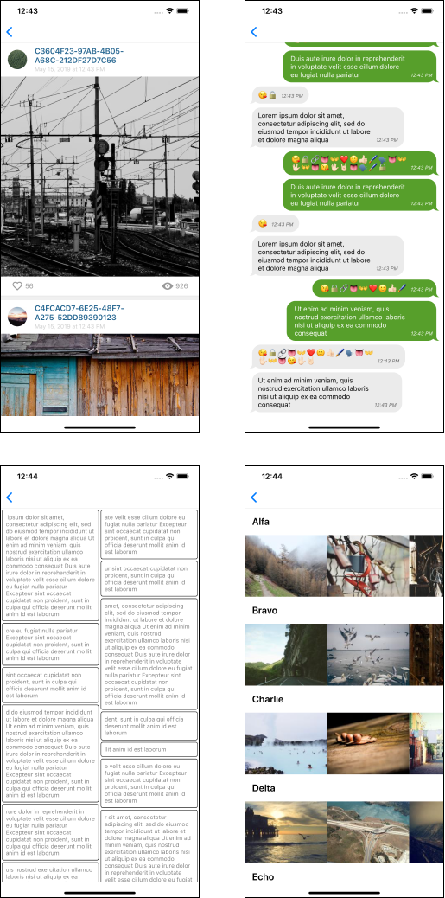

# ALLKit     

A declarative data-driven framework for rapid development of smooth UI

* **Stable and safe** - production ready solution used in some popular apps
* **Easy to use** - simple and clean API
* **Modular** - use only components you need (see [podspec](ALLKit.podspec))
* **Lightweight** - 1K lines of code that greatly simplify development

## Features

* Powerful abstraction over UICollectionView with automatic cells and views management
* Layout calculation in background using [flexbox](https://yogalayout.com)
* Flat view hierarchy with reduced number of subviews

## Installation

`pod 'ALLKit'`

## How to use

Check out the demo project (requires `pod install`) and read the docs:

* [Basic concepts](Docs/basic_concepts.md)
* [Spec example](Docs/hello_world.md)
* [Managing collection views](Docs/list_view.md)
* [Reusable views](Docs/view_recycling.md)
* [Building attributed strings](Docs/string_builder.md)
* [Async text rendering](Docs/async_text.md)
* [Replacing target-actions with closures](Docs/target_actions.md)
* [Animations](Docs/animations.md)
* [AutoDiff](Docs/auto_diff.md)
* [FlexBox](Docs/flexbox.md)

## Apps

* **FantLab** - [Source code](https://github.com/FantLab/FantLab-iOS), [AppStore page](https://itunes.apple.com/ru/app/fantlab/id1444604860?mt=8)

## Demo screenshots

